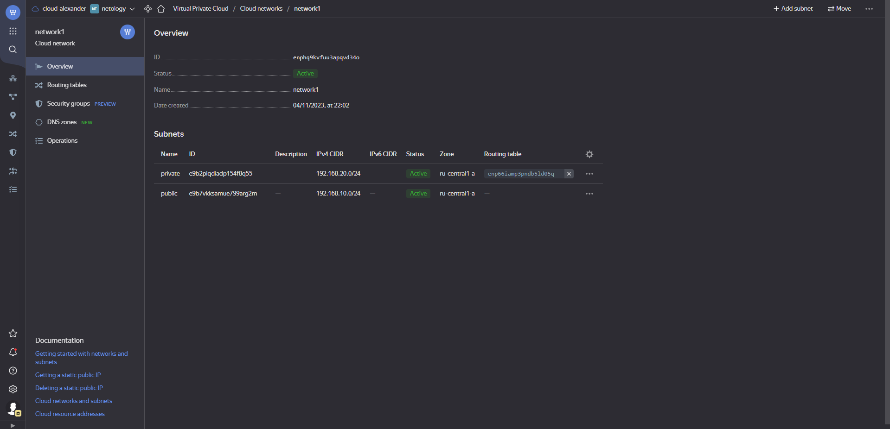

# Решение домашнего задания к занятию "15.1. Организация сети"

## Задание 1. Яндекс.Облако (обязательное к выполнению)

[Конфигурация terraform](./terraform)

```
aledcherry@aledcherry:~/clokub-homeworks/15.1/terraform$ terraform init

Initializing the backend...

Initializing provider plugins...
- Finding latest version of yandex-cloud/yandex...
- Installing yandex-cloud/yandex v0.89.0...
- Installed yandex-cloud/yandex v0.89.0 (self-signed, key ID E40F590B50BB8E40)

Partner and community providers are signed by their developers.
If you'd like to know more about provider signing, you can read about it here:
https://www.terraform.io/docs/cli/plugins/signing.html

Terraform has created a lock file .terraform.lock.hcl to record the provider
selections it made above. Include this file in your version control repository
so that Terraform can guarantee to make the same selections by default when
you run "terraform init" in the future.

Terraform has been successfully initialized!

You may now begin working with Terraform. Try running "terraform plan" to see
any changes that are required for your infrastructure. All Terraform commands
should now work.

If you ever set or change modules or backend configuration for Terraform,
rerun this command to reinitialize your working directory. If you forget, other
commands will detect it and remind you to do so if necessary.
aledcherry@aledcherry:~/clokub-homeworks/15.1/terraform$ terraform validate
Success! The configuration is valid.
aledcherry@aledcherry:~/clokub-homeworks/15.1/terraform$ terraform apply
yandex_vpc_network.network-1: Creating...
yandex_vpc_network.network-1: Still creating... [10s elapsed]
yandex_vpc_network.network-1: Still creating... [20s elapsed]
yandex_vpc_network.network-1: Still creating... [30s elapsed]
yandex_vpc_network.network-1: Still creating... [40s elapsed]
yandex_vpc_network.network-1: Creation complete after 45s [id=enphq9kvfuu3apqvd34o]
yandex_vpc_subnet.subnet-public: Creating...
yandex_vpc_route_table.nat-route-table: Creating...
yandex_vpc_subnet.subnet-public: Creation complete after 0s [id=e9b7vkksamue799arg2m]
yandex_compute_instance.public-vm: Creating...
yandex_compute_instance.nat-instance: Creating...
yandex_vpc_route_table.nat-route-table: Creation complete after 1s [id=enp66iamp3pndb5ld05q]
yandex_vpc_subnet.subnet-private: Creating...
yandex_vpc_subnet.subnet-private: Creation complete after 1s [id=e9b2plqdiadp154f8q55]
yandex_compute_instance.private-vm: Creating...
yandex_compute_instance.public-vm: Still creating... [10s elapsed]
yandex_compute_instance.nat-instance: Still creating... [10s elapsed]
yandex_compute_instance.private-vm: Still creating... [10s elapsed]
yandex_compute_instance.nat-instance: Still creating... [20s elapsed]
yandex_compute_instance.public-vm: Still creating... [20s elapsed]
yandex_compute_instance.private-vm: Still creating... [20s elapsed]
yandex_compute_instance.public-vm: Creation complete after 29s [id=fhmr1l7hj7pj6q63cobg]
yandex_compute_instance.nat-instance: Still creating... [30s elapsed]
yandex_compute_instance.private-vm: Still creating... [30s elapsed]
yandex_compute_instance.private-vm: Creation complete after 32s [id=fhmjdp6fqi4rhejgq1j1]
yandex_compute_instance.nat-instance: Still creating... [40s elapsed]
yandex_compute_instance.nat-instance: Still creating... [50s elapsed]
yandex_compute_instance.nat-instance: Creation complete after 52s [id=fhmkvcvanlt6cftqd1cg]

Apply complete! Resources: 7 added, 0 changed, 0 destroyed.

Outputs:

external_ip_address_nat_vm = "51.250.6.110"
external_ip_address_private_vm = ""
external_ip_address_public_vm = "158.160.41.226"
internal_ip_address_nat_vm = "192.168.10.254"
internal_ip_address_private_vm = "192.168.20.32"
internal_ip_address_public_vm = "192.168.10.9"
aledcherry@aledcherry:~/clokub-homeworks/15.1/terraform$ ssh ubuntu@158.160.41.226
The authenticity of host '158.160.41.226 (158.160.41.226)' can't be established.
ED25519 key fingerprint is SHA256:TkbkwxgySLrXe2GIEgcmz+KYE52sNBc4lhhvHTEtRJk.
This key is not known by any other names
Are you sure you want to continue connecting (yes/no/[fingerprint])? yes
Warning: Permanently added '158.160.41.226' (ED25519) to the list of known hosts.
Welcome to Ubuntu 20.04.5 LTS (GNU/Linux 5.4.0-135-generic x86_64)

 * Documentation:  https://help.ubuntu.com
 * Management:     https://landscape.canonical.com
 * Support:        https://ubuntu.com/advantage

The programs included with the Ubuntu system are free software;
the exact distribution terms for each program are described in the
individual files in /usr/share/doc/*/copyright.

Ubuntu comes with ABSOLUTELY NO WARRANTY, to the extent permitted by
applicable law.

To run a command as administrator (user "root"), use "sudo <command>".
See "man sudo_root" for details.

ubuntu@public-vm1:~$ ping google.com
PING google.com (142.250.150.102) 56(84) bytes of data.
64 bytes from la-in-f102.1e100.net (142.250.150.102): icmp_seq=1 ttl=61 time=21.4 ms
64 bytes from la-in-f102.1e100.net (142.250.150.102): icmp_seq=2 ttl=61 time=21.0 ms
64 bytes from la-in-f102.1e100.net (142.250.150.102): icmp_seq=3 ttl=61 time=21.0 ms
64 bytes from la-in-f102.1e100.net (142.250.150.102): icmp_seq=4 ttl=61 time=21.2 ms
^C
--- google.com ping statistics ---
4 packets transmitted, 4 received, 0% packet loss, time 3004ms
rtt min/avg/max/mdev = 20.957/21.151/21.374/0.165 ms
```




